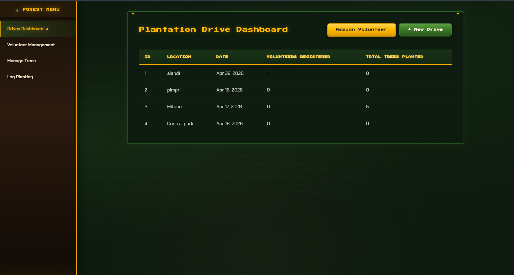
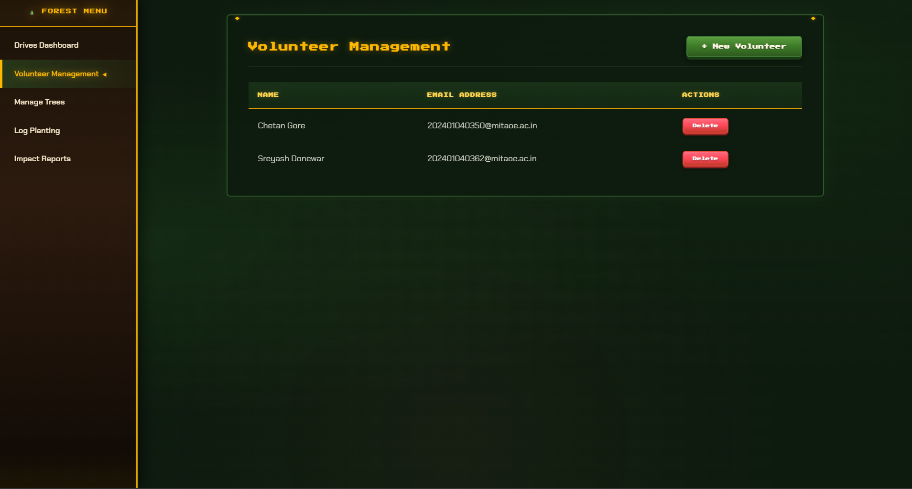
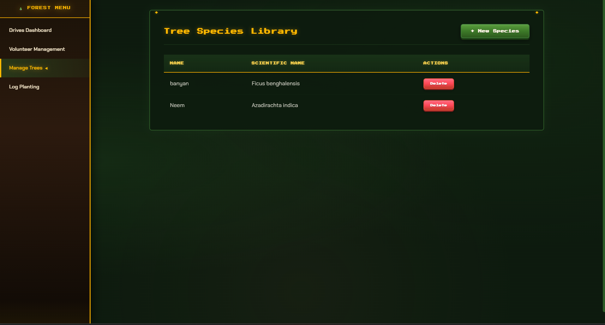
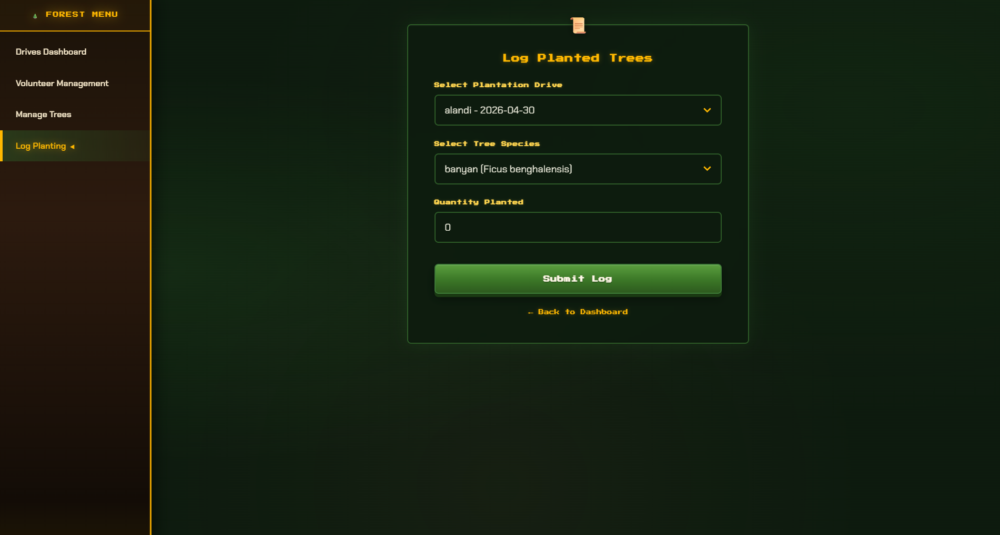

# 🌲 Tree Plantation Management Website

A full-stack **Java EE web application** for managing tree plantation drives, volunteers, and tree species — built with JSF, Spring, Hibernate, and MySQL, styled with a **Nature/Forest Management Game UI**.

---

## 🎮 Features

- **Plantation Drive Dashboard** — Create, view, and manage plantation drives
- **Volunteer Management** — Register volunteers, assign them to drives, track participation
- **Tree Species Library** — Catalog tree species with scientific names
- **Planting Logger** — Log tree planting events per drive with quantity tracking
- **Impact Reports** — Dashboard with stat cards, top reforesters, and species diversity analytics
- **Coordinator Admin Panel** — JDBC-based analytics and weather status alerts
- **Game-Style UI** — Resource-management-game aesthetic with 3D tactile buttons, quest-log panels, animated progress bars, and pixel-art typography

---

## 🛠️ Tech Stack

| Layer | Technology |
|---|---|
| **Frontend** | JSF 2.2 (XHTML), Custom CSS (Game UI Theme) |
| **Backend** | Spring 5 (Core, ORM, TX), JSF Managed Beans |
| **ORM** | Hibernate 5.6 |
| **Database** | MySQL 8 |
| **Server** | Apache Tomcat 9+ |
| **Build** | Maven |
| **Java** | 11+ |

---

## 📂 Project Structure

```
src/main/
├── java/com/treeplantation/
│   ├── model/          # JPA Entities (Volunteer, PlantationDrive, Tree)
│   ├── dao/            # Data Access Objects (Hibernate SessionFactory)
│   ├── service/        # Business Logic Layer
│   └── web/           # JSF Managed Beans (Controllers)
├── resources/
│   ├── applicationContext.xml   # Spring + Hibernate configuration
│   └── database.properties      # DB credentials (gitignored)
└── webapp/
    ├── css/game-ui.css          # Shared game-themed stylesheet
    ├── index.xhtml              # Drive Dashboard
    ├── volunteers.xhtml         # Volunteer Management
    ├── tree-species.xhtml       # Tree Species Library
    ├── log-planting.xhtml       # Planting Logger
    ├── reports.xhtml            # Impact Dashboard
    ├── add-*.xhtml              # Form pages (quest-style)
    ├── assign-volunteer.xhtml   # Volunteer assignment
    └── admin.xhtml              # Coordinator Admin Panel
```

---

## 🚀 Setup & Run

### Prerequisites

- **JDK 11+**
- **Apache Tomcat 9+**
- **MySQL 8+**
- **Maven 3.6+**
- **Eclipse IDE** (recommended) with Maven and Server adapters

### 1. Clone the Repository

```bash
git clone https://github.com/codewithsreyash/TreePlantationManagementWebsite.git
cd TreePlantationManagementWebsite
```

### 2. Configure Database

Copy the template and fill in your MySQL credentials:

```bash
cp database.properties.template src/main/resources/database.properties
```

Edit `src/main/resources/database.properties`:

```properties
db.url=jdbc:mysql://localhost:3306/treeplantation?createDatabaseIfNotExist=true&useSSL=false&serverTimezone=UTC
db.username=root
db.password=YOUR_PASSWORD_HERE
```

> Hibernate will auto-create tables on first run (`hibernate.hbm2ddl.auto=update`).

### 3. Build with Maven

```bash
mvn clean package
```

This produces `target/TreePlantationApp.war`.

### 4. Deploy to Tomcat

- **Via Eclipse**: Add the project to a Tomcat server adapter → Right-click → *Run on Server*
- **Manual**: Copy `TreePlantationApp.war` to Tomcat's `webapps/` directory

### 5. Access the App

Navigate to: `http://localhost:8080/TreePlantationApp/`

---

## 🗄️ Database Schema

The app uses three main tables with two join tables:

- `volunteer` — id, name, email
- `plantation_drive` — id, location, drive_date
- `tree` — id, name, scientific_name
- `drive_volunteers` — drive_id (FK → plantation_drive), volunteer_id (FK → volunteer) — **ON DELETE CASCADE**
- `drive_trees` — drive_id (FK → plantation_drive), tree_id (FK → tree)

> The `drive_volunteers` join table uses `ON DELETE CASCADE` on both foreign keys, so deleting a volunteer or drive automatically cleans up the association.

---

## 🎨 UI Theme

The interface uses a **"Nature / Forest Management Game"** aesthetic inspired by SimCity and Stardew Valley:

- **Palette**: Deep forest greens (`#2d5a27`), earthy browns, glowing amber (`#FFB800`)
- **Typography**: `'Press Start 2P'` (pixel-art headings), `'Chakra Petch'` (body text)
- **3D Buttons**: Tactile pressable buttons with hover-glow and depth shadows
- **Quest Log Panels**: Dark translucent panels with amber-accented headers
- **Game Menu Sidebar**: Fixed sidebar navigation with skill-tree-style active indicators
- **Dashboard Cards**: Animated progress bars and "Level Up" pulse icons
- **Quest Feedback**: "✓ QUEST COMPLETE!" flash animation on form submissions

All styling is centralized in a single shared CSS file (`webapp/css/game-ui.css`), keeping XHTML templates clean and JSF-compatible.

---

## � Screenshots

### 🌲 Plantation Drive Dashboard


### 👥 Volunteer Management


### 🌿 Tree Species Library


### 📝 Log Planted Trees (Quest Form)


> **Note:** The "Forest Menu" sidebar navigation glows amber for the active page. Tables use pixel-art headers with amber underlines, and forms feature the scroll 📜 decoration with 3D tactile buttons.

---

## �📄 License

This project is open source and available under the [MIT License](LICENSE).
