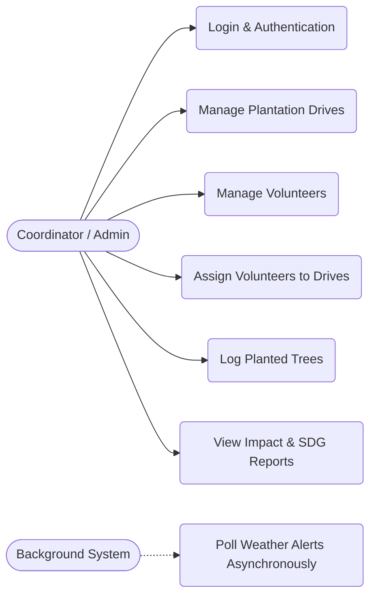
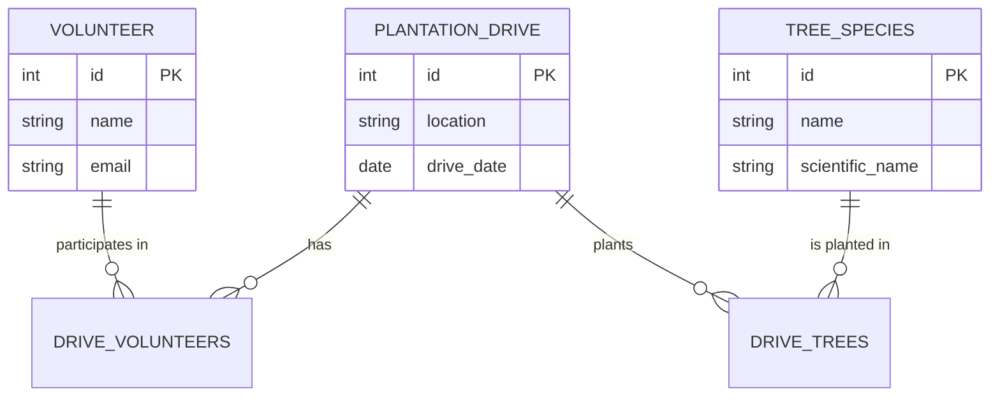
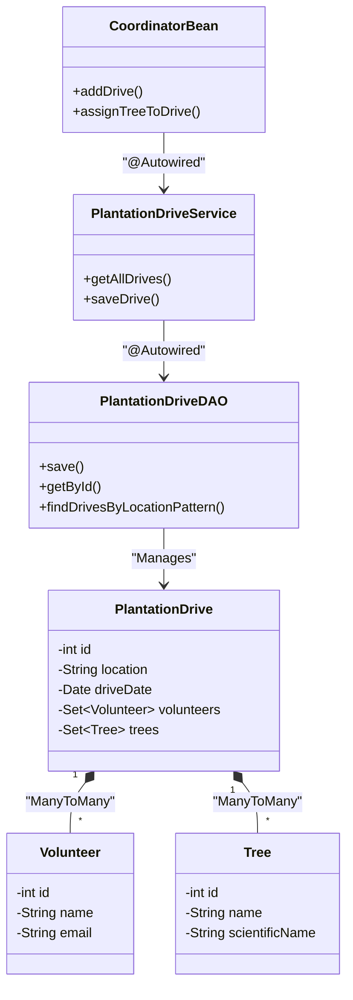
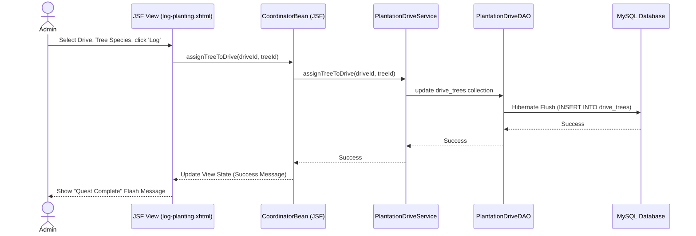
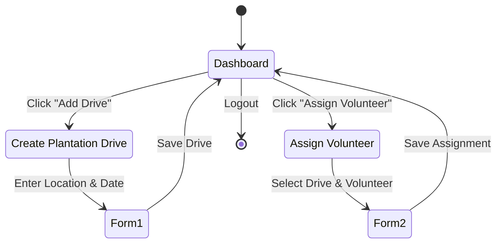

# System Architecture & Diagrams

This document contains the essential UML and structural diagrams for the Tree Plantation Management System. These diagrams utilize Mermaid.js to render natively in GitHub.

---

## 1. Use Case Diagram
This diagram outlines the primary interactions the Coordinator has with the system.

---

## 2. Entity-Relationship (ER) Diagram
This illustrates the database schema, including the two many-to-many join tables (`drive_volunteers` and `drive_trees`).

---

## 3. Class Diagram (Core Architecture)
This diagram shows the relationship between the Spring managed beans, Services, DAOs, and Hibernate JPA Entities.

---

## 4. Sequence Diagram (Logging Planted Trees)
This illustrates the end-to-end request flow when an admin logs a new tree planting activity.

---

## 5. Activity Diagram (Creating a Drive & Assigning Volunteers)
This flow shows the steps required to organize a new plantation drive and assign a volunteer.

